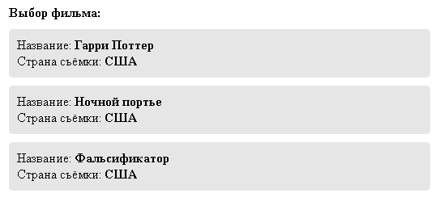
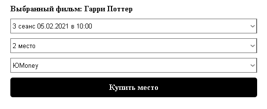
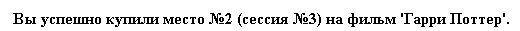
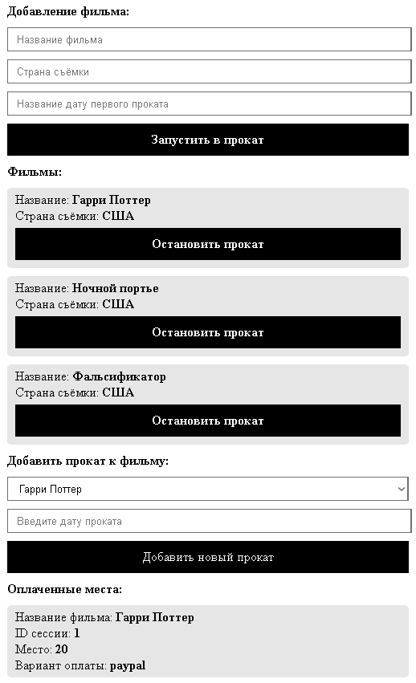

# Покупка билетов

## Установка
Для установки нам понадобиться сервер с поддержкой *PHP* + *MySQL*  
Нам нужно:
* установить файлы в вашу директорию
* установить базу данных *(она называется buyticket.sql)*
* в файле *connect.php* указать ваши данные для присоединения к базе данных

## Инструкция
### Стартовая страница
На стартовой странице у нас отображаются все доступные фильмы  
В блоке фильма отображается название и страна съёмки фильма

### Покупка билета
Когда вы нажали на интересующий фильм на стартовой странице, вас перекинет на страницу покупки билета  
Здесь необходимо выбрать сеанс, место и способ оплаты

Если всё успешно, то у вас отобразиться:

## Админ панель
Для того, чтобы изменять данные, в проекте есть админ-панель  
Доступна она по адресу `example.com/ap.php`

В ней мы можем добавить и посмотреть какие фильмы уже есть  
Также можно добавить прокат к фильму и увидеть оплаченные места

